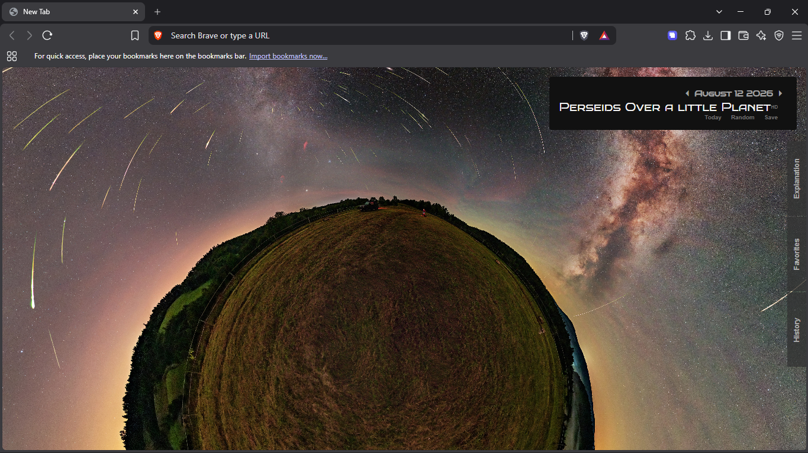

# 🌌 AstroInfo

AstroInfo is a Chrome extension that replaces your **New Tab** page with NASA's [Astronomy Picture of the Day (APOD)](https://apod.nasa.gov/apod/astropix.html) — a new space image, its title, and a full explanation, right when you open a tab.

### New Tab View


This project was inspired by [APOD Chrome Extension](https://github.com/TravisL12/apod_chrome_extension) by [TravisL12](https://github.com/TravisL12) — credit to the original for the idea and feature set (favorites, new tab APOD viewing) that this project builds on with its own implementation.


## Features

- 🖼️ **Daily astronomy picture** — fetches the current day's image and HD image straight from NASA's APOD API as your new tab background
- ⏪⏩ **Browse past & future days** — step backward/forward through previous APOD entries with arrow controls
- 🎲 **Random** — jump to a random day's picture
- ⭐ **Favorites** — save pictures you like for quick access later
- 🕘 **History** — automatically keeps a local history of pictures you've viewed
- 📖 **Explanation panel** — a slide-out panel with the title and full write-up for each image
- 💾 **Local persistence** — favorites and history are stored in the browser via `localStorage`, so they survive restarts

## Tech Stack

- [React 18](https://react.dev/) (bootstrapped with [Create React App](https://create-react-app.dev/))
- React Context API for state management (image data, UI state, and app functionality are split across separate contexts)
- [NASA APOD API](https://api.nasa.gov/) for image data
- Chrome Extension [Manifest V3](https://developer.chrome.com/docs/extensions/mv3/intro/)

## Project Structure

```
astro_info/
├── public/
│   ├── index.html          # New tab page markup
│   └── manifest.json       # Chrome extension manifest
├── src/
│   ├── components/
│   │   ├── screens/        # MainBody, DateAndTimeShower, SideSlider, LoadingSpinner
│   │   └── styles/          # Component-level CSS
│   ├── context/
│   │   ├── infoContext/     # NASA APOD data fetching context
│   │   ├── functions/       # App behavior (date navigation, favorites, history)
│   │   └── valueStorage/    # UI state (slider position, loading state, etc.)
│   ├── App.js
│   └── index.js
├── package.json
└── package-lock.json
```

## Getting Started

### Prerequisites

- [Node.js](https://nodejs.org/) and npm
- A free NASA API key from [api.nasa.gov](https://api.nasa.gov/) (NASA's `DEMO_KEY` works too, but it has a very low rate limit)

### Installation

1. Clone the repo
   ```bash
   git clone https://github.com/official-naveen/Astro-Info-Chrome-Extension
   cd Astro-Info-Chrome-Extension
   ```
2. Install dependencies
   ```bash
   npm install
   ```
3. Add your NASA API key. Create a `.env` file in the project root:
   ```
   REACT_APP_NASA_API_KEY=your_api_key_here
   ```
   > ⚠️ This project currently references NASA's API key directly in the source. Before publishing, swap those hardcoded values for `process.env.REACT_APP_NASA_API_KEY` and make sure `.env` is listed in `.gitignore` so your key isn't committed.
4. Build the extension
   ```bash
   npm run build
   ```

### Load it into Chrome

1. Open `chrome://extensions`
2. Enable **Developer mode** (top right)
3. Click **Load unpacked**
4. Select the `build/` folder created by `npm run build`
5. Open a new tab to see it in action

## Available Scripts

| Command | Description |
|---|---|
| `npm start` | Runs the app in development mode at `localhost:3000` |
| `npm run build` | Builds the app for production to the `build/` folder |
| `npm test` | Runs the test runner |

## Roadmap / Ideas

- [ ] Move the NASA API key into an environment variable
- [ ] Add a settings/options page
- [ ] Support video-of-the-day entries (APOD occasionally returns videos, not just images)
- [ ] Add search by specific date

## Contributing

Contributions, issues, and feature requests are welcome. Feel free to check the [issues page](../../issues) if you want to contribute.

## License

This project currently has no license file. Consider adding one (e.g. [MIT](https://choosealicense.com/licenses/mit/)) so others know how they can use your code.

## Acknowledgements

- [NASA APOD API](https://api.nasa.gov/) for the daily imagery and data
- [Create React App](https://create-react-app.dev/) for the project bootstrap
